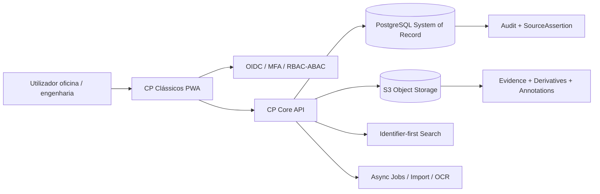
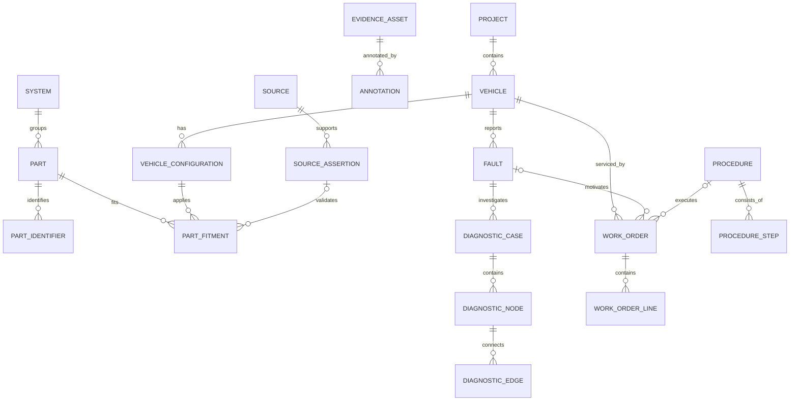
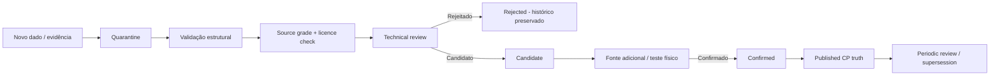
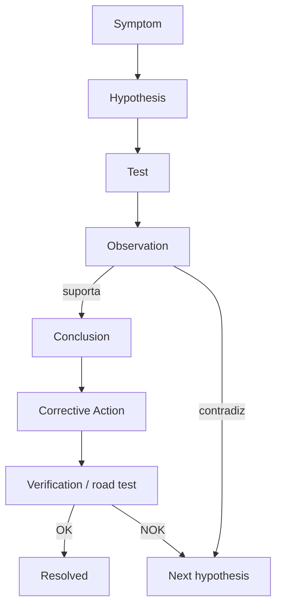
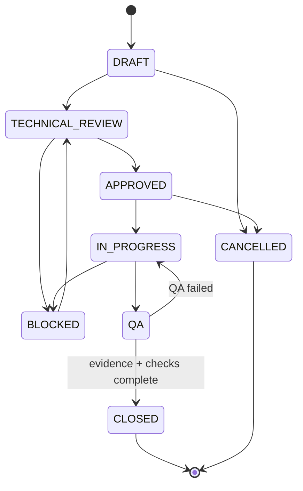
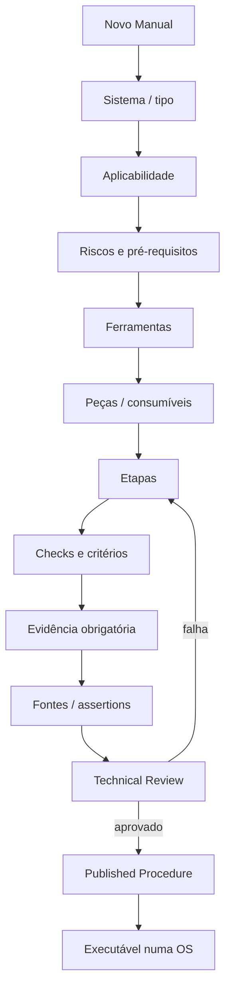
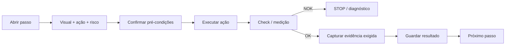
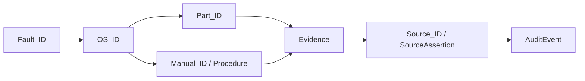
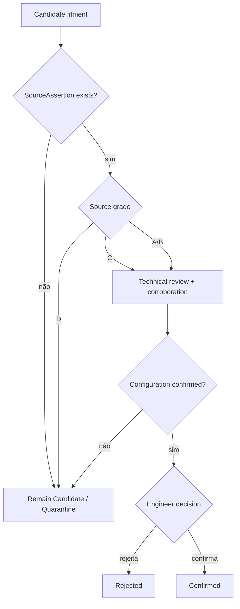

# CP Clássicos — Fluxogramas de arquitetura e domínio

## 1. Arquitetura lógica


## 2. Relações principais


## 3. Provenance / verdade técnica


## 4. Diagnóstico dirigido


## 5. Ordem de Serviço


## 6. Criação e publicação de manual


## 7. Execução de um passo de manual


## 8. Rastreabilidade CP


## 9. Upload de evidência imutável
```mermaid
sequenceDiagram
 participant UI as CP App
 participant API as Core API
 participant OBJ as Object Storage
 participant DB as PostgreSQL
 UI->>API: initiate-upload(filename, mime, sha256)
 API->>DB: verify duplicate hash
 API-->>UI: signed upload target
 UI->>OBJ: upload original bytes
 UI->>API: complete upload
 API->>OBJ: verify object/hash
 API->>DB: create EvidenceAsset immutable=true
 API-->>UI: asset_id
 Note over OBJ,DB: Original never overwritten; derivatives are separate assets
```

## 10. Gate de confirmação de fitment

